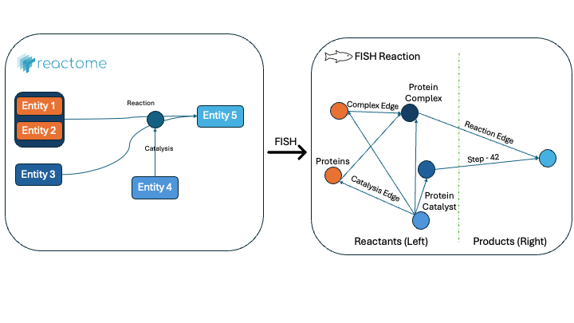

# Reactome BioPAX Parser



Parse Reactome BioPAX Level 3 pathway files into directed temporal graphs (NetworkX) or hypergraphs (HyperNetX), preserving causal ordering, edge typing, and biological annotations.

This is the parsing layer of [FISH](#) (Feature Integration from Signalling Hypergraphs), a pipeline for temporal pathway prediction. It can be used standalone if you just need to convert Reactome pathway data into a graph structure suitable for analysis or machine learning.

## What it does

Reactome distributes its pathway data as BioPAX Level 3 XML files — a rich ontological format where reactions are hyperedges with multiple participants, entities can be alternatives in OR-groups, complexes have hierarchical compositions, and reaction order is encoded by `PathwayStep` chains. This package navigates that structure and produces a flat directed graph where:

- **Nodes** are biological entities (proteins, complexes, small molecules, DNA, RNA), labelled by name and cellular compartment (e.g. `ATP [cytosol]`)
- **Edges** are typed pairwise interactions extracted from reactions
- **Each edge carries a `time` attribute** giving its position in the pathway's causal order

## Installation

```bash
pip install -e .
```

Required: `networkx`. Optional: `tqdm` (progress bars), `hypernetx` (for hypergraph output).

## Quick start

```python
from reactome_biopax import ReactomeBioPAX

parser = ReactomeBioPAX(uniprot_accession_num=True)
G = parser.parse_biopax_into_networkx("R-HSA-168256.owl")

print(G.number_of_nodes(), "nodes")
print(G.number_of_edges(), "edges")
```

`G` is a `networkx.DiGraph`. Each node and edge carries metadata:

```python
G.nodes["TLR4 [plasma membrane]"]
# {'type': 'protein', 'name': 'TLR4', 'cellularLocation': {...}, 'uniprot_id': 'O00206', ...}

G["TLR4 [plasma membrane]"]["MyD88 [cytosol]"]
# {'type': 'reaction', 'time': 47, 'pathway': 'TLR4 cascade', ...}
```

## API

### `parse_biopax_into_networkx(filename, reaction_partners=False, include_complexes=True)`

The main entry point. Returns a directed NetworkX graph.

| Argument | Default | Meaning |
|---|---|---|
| `filename` | required | Path to a BioPAX Level 3 `.owl` or `.xml` file |
| `reaction_partners` | `False` | If `True`, add bidirectional `left_reactant` and `right_product` edges between co-participants on the same side of each reaction |
| `include_complexes` | `True` | If `True`, complexes are graph nodes with `complex_component` edges from their members. If `False`, complexes are dissolved into bidirectional co-membership edges between their leaf proteins |

### Edge types

| Type | Direction | Meaning |
|---|---|---|
| `reaction` | left → right | Substrate becomes product (within a `BiochemicalReaction`) |
| `catalysis` | catalyst → substrate | Enzyme catalysing a reaction; carries `catalysis_type` ∈ {`ACTIVATION`, `INHIBITION`} |
| `translocation` | source → target | An entity moving between cellular compartments |
| `expression` | gene → product | Transcription/translation events (DNA → many proteins) |
| `complex_component` | member → complex | Component is part of a complex (or member ↔ member if `include_complexes=False`) |
| `left_reactant` | left ↔ left | Co-reactants on the same reaction side (only if `reaction_partners=True`) |
| `right_product` | right ↔ right | Co-products on the same reaction side (only if `reaction_partners=True`) |

### Edge attributes

Every edge carries:

- `type` — one of the edge types above
- `time` — integer pathway-step rank (causal order; not wall-clock)
- `local_order` — position within a single `PathwayStep`, if available
- `pathway` — name of the most specific containing sub-pathway
- `catalysis_type` (catalysis edges only) — activation or inhibition

### Node attributes

Every node carries:

- `type` — `protein`, `complex`, `dna`, `rna`, `small_molecule`, or `physical_entity`
- `name` — display name
- `cellularLocation` — compartment metadata (dict with `common_name`, `DB_ID`)
- Identifiers where resolvable: `uniprot_id` (proteins), `ref_id` (small molecules / nucleic acids)

## Representational design choices

The BioPAX data model has several ambiguities that any parser must resolve. This package makes these choices explicit; they are documented in detail in the FISH paper (§2).

### Complex representation

Two modes (`include_complexes`):

- **`True` (default)**: Complexes are graph nodes with directed `complex_component` edges from leaf members. Encodes assembly hierarchy.
- **`False`**: Complexes are dissolved; bidirectional `complex_component` edges connect every pair of leaf members of each reaction-participating complex. Encodes co-presence.

## Hypergraph output

```python
H = parser.parse_biopax_into_hypergraph("pathway.xml")
```

Returns a `hypernetx.Hypergraph` where each reaction is a single hyperedge with all its participants. Useful for hyperedge-native models (e.g. Relational Hyperevent Models). Requires `hypernetx`.

## Logging

Pass a logger to surface parsing progress and warnings:

```python
import logging
logging.basicConfig(level=logging.INFO)
logger = logging.getLogger()

parser = ReactomeBioPAX(uniprot_accession_num=True, logger=logger)
G = parser.parse_biopax_into_networkx("pathway.owl")
```

`ReactomeBioPAX` is composed via mixins; users only interact with the unified class.

## Running the GNN benchmarks

`run_benchmarks.sh` at the project root tunes and/or runs all three GNN baselines (RGCN, TGAT, HGCN) in one command. See [`baselines/GNNs/README.md`](baselines/GNNs/README.md) for the full benchmark description.

```bash
# Run all three models on the Immune pathway (no tuning, default settings)
./run_benchmarks.sh

# Tune then benchmark on GPU, saving results to a custom directory
./run_benchmarks.sh --tune --gpu --out-dir results/immune_tuned

# Only benchmark TGAT and HGCN using a pre-featurised pickle
./run_benchmarks.sh --models tgat,hgcn --pickle immune.pkl

# Quick smoke-test
./run_benchmarks.sh --epochs 50 --seeds 2
```

### Flag reference

| Flag | Default | Description |
|---|---|---|
| `--biopax PATH` | `data/biopax3/R-HSA-168256.xml` | BioPAX XML to parse. Mutually exclusive with `--pickle`. |
| `--pickle PATH` | — | Pre-featurised graph pickle. Skips parsing (much faster for repeated runs). |
| `--pathway-name NAME` | `Immune` | Human-readable name embedded in output files and summary tables. |
| `--models LIST` | `rgcn,tgat,hgcn` | Comma-separated subset of models to run. |
| `--tune` | off | Run Optuna sweeps before benchmarking and apply the best params. |
| `--n-trials N` | `50` | Optuna trials per model (only used with `--tune`). |
| `--epochs N` | `200` | Training epochs per benchmark run. |
| `--seeds N` | `5` | Random seeds per condition (results reported as mean ± std). |
| `--hidden N` | `128` | Encoder hidden dimension. |
| `--n-layers N` | `2` | Number of encoder layers. |
| `--lr LR` | `0.001` | Learning rate. |
| `--dropout D` | `0.2` | Dropout rate. |
| `--n-negatives N` | `10` | Negative samples per positive (existence head). |
| `--order-weight W` | `1.0` | Extra weight on the order-task loss. |
| `--time-target MODE` | `min_max` | Order regression target transform (`min_max`, `log_min_max`, `rank`). |
| `--hits` | off | Compute Hits@K (expensive). |
| `--smart-train` | off | Type-matched negatives during training. |
| `--compartment-emb PATH` | — | `.npz`/`.pkl`/`.tsv` of compartment embeddings (e.g. GO2Vec). |
| `--out-dir DIR` | `results` | Output directory (created if absent). |
| `--gpu` | auto | Force CUDA. |
| `--cpu` | auto | Force CPU. |
| `--venv PATH` | `.venv` | Virtual environment to activate. |
| `--storage URL` | `sqlite:///results/optuna_studies.db` | Optuna storage shared by all tuners. |
| `--include-rgat` | off | *(RGCN only)* Also run RGAT conditions (12 → 24 conditions). |
| `--n-heads N` | `2` (TGAT) / `1` (HGCN) | Attention heads. |
| `--time-dim N` | `64` | *(TGAT only)* Time2Vec output dimension. |
| `--edge-feat-dim N` | `32` | *(TGAT only)* Edge-type embedding dimension. |
| `--max-neighbors N` | `20` | *(TGAT only)* Most-recent neighbours per node during encoding. |
| `--use-attention` | off | *(HGCN only)* Use attention variant of `HypergraphConv`. |

All output files land in `--out-dir`:

```
results/
  results_rgcn.json / .csv
  results_tgat.json / .csv
  results_hgcn.json / .csv
  best_params_rgcn.json       # only when --tune
  best_params_tgat.json
  best_params_hgcn.json
  optuna_history_rgcn.csv
  optuna_history_tgat.csv
  optuna_history_hgcn.csv
  optuna_studies.db           # shared Optuna SQLite store
```

## Citing

If you use this in academic work, please cite the FISH paper:


And the underlying data sources:

- **Reactome**: Milacic et al. (2024), *Nucleic Acids Research*
- **BioPAX**: Demir et al. (2010), *Nature Biotechnology*

## Contributing

Issues and pull requests welcome. The pipeline aims to support the full Reactome corpus; if you hit a pathway it can't parse, please open an issue with the file ID.
